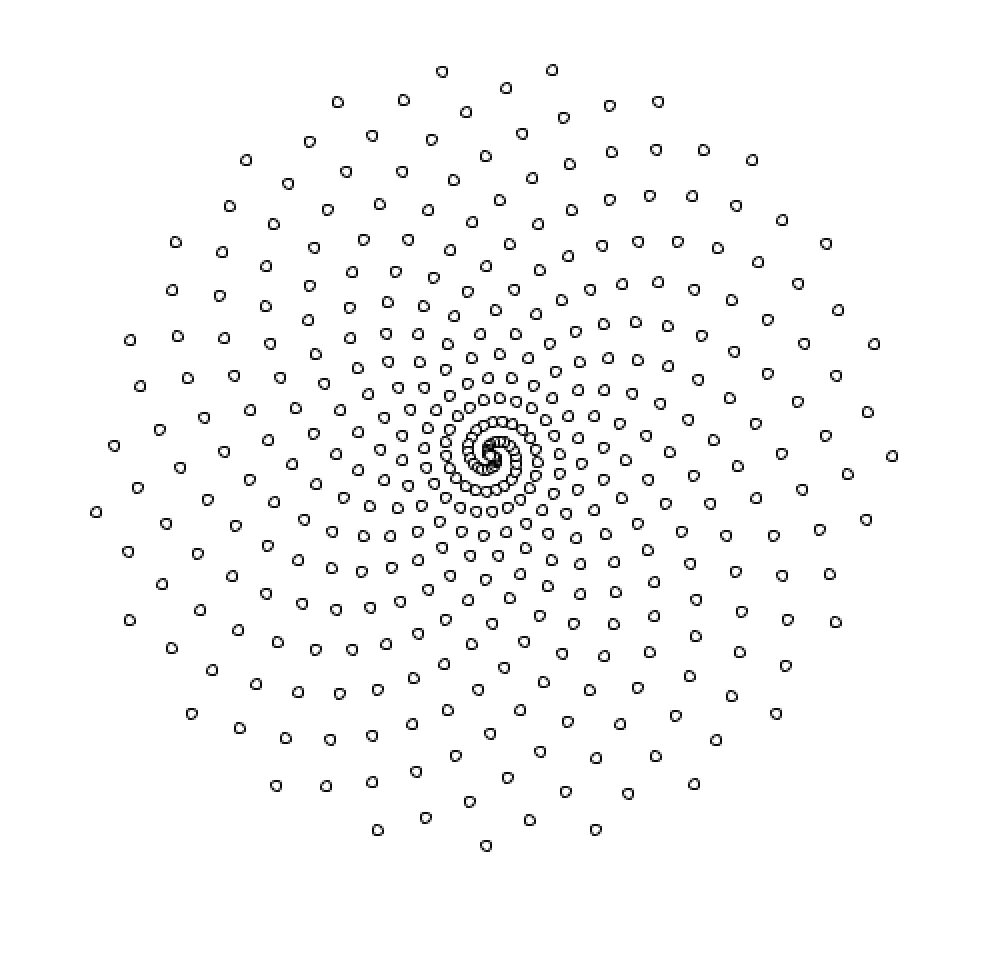
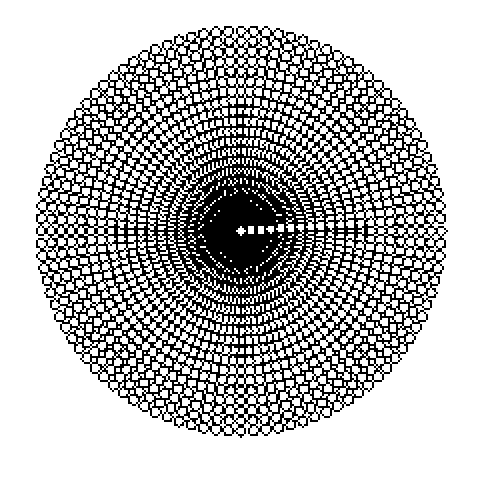
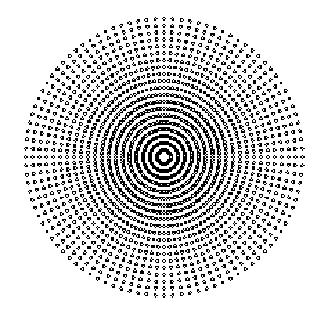

# parametric-description-sampling
Another work from Computer graphics at IME, it samples points in a sphere that is described parametrically 

The first result I got wrong, but I liked the output image, I will use it in my next album

Then I fixed the issue

Then I have calibrated the parameters

